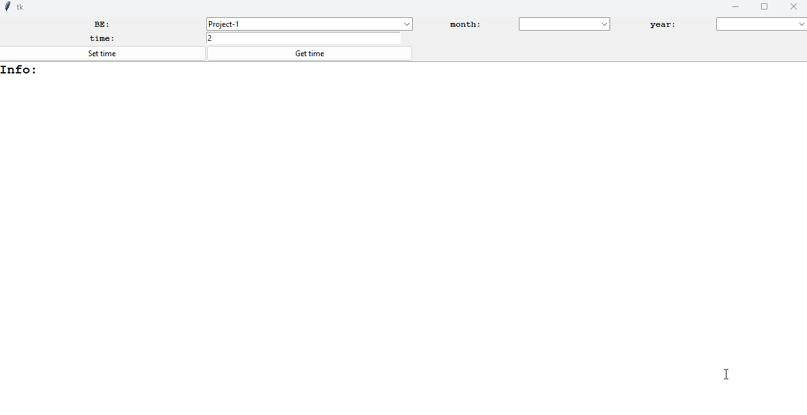
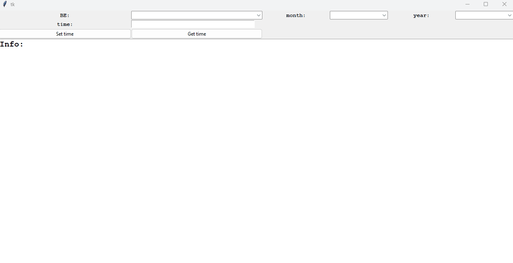

# ProTiRecord
simple python application to store time on different project numbers

Simply insert a projectnumber and the time store it by pressing "set time" and add it if it is the same month the same year and project.

By filling out the information above BE month and year you can deside witch information you want to display.

